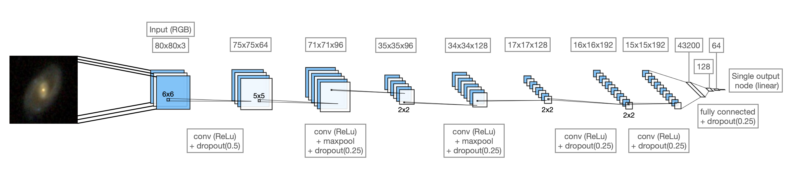

# sdss_clustering

Clustering of Sloan Digitial Sky Survey (SDSS) galaxy images (RGB) using transfer learning (from pre-trained convolutional neural networks), and/or principal component analysis, and, hierarchical (agglomerative) clustering.

- Here, we create representations of galaxy images through use of the output from a convolutional neural network (CNN). 
- The output features (i.e. layer of output nodes) are then compressed by principal component analysis. 
- These _super_-features are then used as the parameter space to cluster together the images 

## Data

SDSS has created the most detailed three-dimensional maps of the Universe (_so far_) with deep multi-color images of galaxies covering one third of the sky. The vast majority of MaNGA galaxies have been imaged by SDSS, which we can use as input into our convolutional neural network. The exact resolution of an image (relative to the galaxy size) is variable (since it is dependent on the distance to the galaxy). 

Galaxy images are pulled from the SDSS database on [sciserver](https://www.sciserver.org/) see in `./data/on_sciserver/`. Each image downloaded is 424 x 424 pixels in size where each pixel is set to be 0.02Re (elliptical petrosian half-light radius) of the target galaxy (i.e. image covers 8.48Re for each galaxy). 

### Pre-processing
For input into the CNN, we downsample all galaxy images to be size (80, 80, 3) (to avoid fitting noise), and, normalised so pixel values (in each channel) range [0, 1]. We have 6437 galaxies with SDSS images.

## CNN

Here we use a pre-trained convolutional neural network (CNN) in order to extract distinct features for the set of SDSS images. The structure and training of the CNN is described in this [repo](https://github.com/Chris-Duckworth/sdss_CNN). The CNN structure can be summarised by this schematic : 

In order to repurpose this network for the aim of clustering (rather than its original purpose of regression), we remove the output layer (i.e. single node with linear activation), along with a variable number of hidden fully connected layers. We consider 1D (i.e. flattened) output directly from the final convolutional block, and, after the penultimate hidden layer corresponding to 37632 and 128 output _features_ respectively.

## Principal Component Analysis 

While these feature sets represent a host of different characteristics about the galaxy images, there are currently too higher dimension (at least for the 37632 output) to use as a parameter space for clustering. To effectively compress information (and hence reduce the number of dimensions), principal component analysis (PCA; [`sklearn.decomposition`](https://scikit-learn.org/stable/modules/classes.html#module-sklearn.decomposition)) is applied to the CNN output. PCA works by fitting a series of n _principle components_ (i.e. set of orthogonal lines that can be defined as the directions that maximise the variance in the data [within the original parameter space]). PCA effectively identifies correlated dimensions, reducing the required number of parameters required to represent the data, while retaining maximal variance encapsulated by the original information. Our final feature sets (i.e. used for clustering) can be summarised by the following table : 

| CNN nfeatures | PCA nfeatures | Original variance | Label |
| ------------- | ------------- | ------------- | ------------- |
| 37632 | 100 | 94.36% | `CNN-37632_PCA-100` |
| 128 | 20 | 99.86% | `CNN-128_PCA-20` |

In the following, we will consider clustering applied to `CNN-37632_PCA-100`, however, in most cases we also include output from `CNN-128_PCA-20` in the corresponding directories. The relative importance (more strictly speaking _variance ratio_) of the principle components for `CNN-37632_PCA-100` are shown here :

## Clustering 

To cluster galaxy images, three distinct clustering algorithms (from [`sklearn.cluster`](https://scikit-learn.org/stable/modules/classes.html#module-sklearn.cluster)) are applied to the output set of image features. We select :
  - **k-means :** (i.e. generating a target number of distinct convex clusters that minimise within cluster variances)
  - **Affinity propagation :** which finds 'exemplars' (i.e. prime examples for a representative group) through sending 'messages' between each of the samples. Here you define groups (or their exemplars) to minimise a certain metric (e.g. average distance between samples in the parameter space or variance).
  - **Agglomerative :** hierarchical bottom-up clustering (i.e. iteratively merging together the nearest nodes - starting with individual galaxies until desired number of clusters are found)

A quick summary of their implementation (with jupyter notebook) can be found here : 

| Algorithm | nclusters | Notebook | Hyperparameters |
| ------------- | ------------- | ------------- | ------------- |
| [k-means](https://scikit-learn.org/stable/modules/generated/sklearn.cluster.KMeans.html#sklearn.cluster.KMeans) | 10 | [`kmeans_CNN_clustering.ipynb`](./transfer_learning/kmeans_CNN_clustering.ipynb) | |
| [Affinity propagation](https://scikit-learn.org/stable/modules/generated/sklearn.cluster.AffinityPropagation.html#sklearn.cluster.AffinityPropagation) | 176 | [`affinity_propagation_CNN_clustering.ipynb`](./transfer_learning/affinity_propagation_CNN_clustering.ipynb) | **Damping** : 0.8 |
| [Agglomerative](https://scikit-learn.org/stable/modules/generated/sklearn.cluster.AgglomerativeClustering.html#sklearn.cluster.AgglomerativeClustering) | 32 | [`agglomerative_CNN_clustering.ipynb`](./transfer_learning/agglomerative_CNN_clustering.ipynb) | **Linkage** : 'ward' |

## Baseline comparison
As a baseline test of image similarity clustering, we consider all pixel values (in each of the 3 colour channels) as distinct features (i.e. dimensions in the parameter space).
Since we are working with images of size (80, 80, 3), this corresponds to 19200 dimensions which is difficult to cluster directly. 
To compress information we apply a principal component analysis (pca) which transforms the parameter space, by considering a line orthogonal to the existing parameter dimensions, while minimising the distance of points from this line.
This equates to find dimensions that have maximal variance along them, hence compressing information while retaining a significant fraction of variance in the data.
Here, this can be thought of finding pixels that are highly correlated and linking them.
