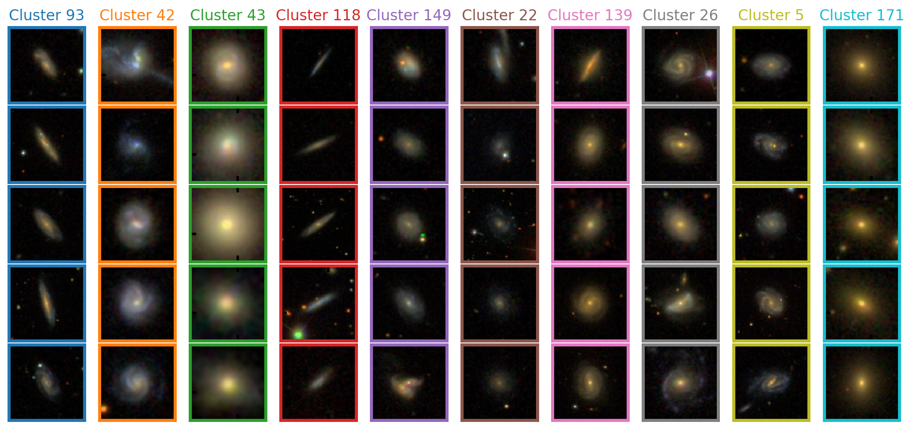
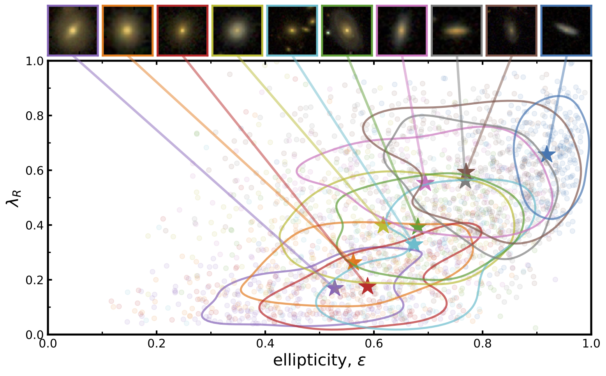
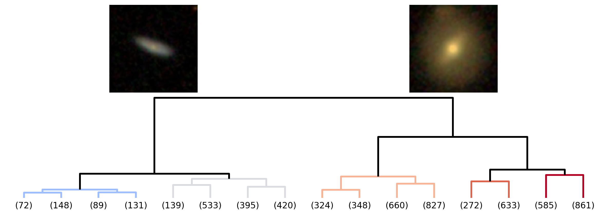
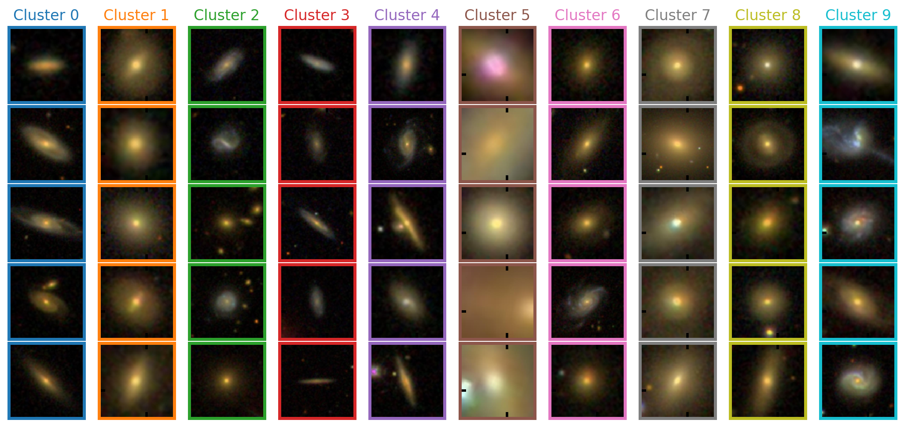

# sdss_clustering

Clustering of Sloan Digitial Sky Survey (SDSS) galaxy images (RGB) using transfer learning (from pre-trained convolutional neural networks), and/or principal component analysis, and, hierarchical (agglomerative) clustering.

- Here, we create representations of galaxy images through use of the output from a convolutional neural network (CNN). 
- The output features (i.e. layer of output nodes) are then compressed by principal component analysis. 
- These _super_-features are then used as the parameter space to cluster together the images 

## Data

SDSS has created the most detailed three-dimensional maps of the Universe (_so far_) with deep multi-color images of galaxies covering one third of the sky. The vast majority of MaNGA galaxies have been imaged by SDSS, which we can use as input into our convolutional neural network. The exact resolution of an image (relative to the galaxy size) is variable (since it is dependent on the distance to the galaxy). 

Galaxy images are pulled from the SDSS database on [sciserver](https://www.sciserver.org/) see in `./data/on_sciserver/`. Each image downloaded is 424 x 424 pixels in size where each pixel is set to be 0.02Re (elliptical petrosian half-light radius) of the target galaxy (i.e. image covers 8.48Re for each galaxy). 

### Pre-processing
For input into the CNN, we downsample all galaxy images to be size (80, 80, 3) (to avoid fitting noise), and, normalised so pixel values (in each channel) range [0, 1]. We have 6437 galaxies with SDSS images.

## CNN

Here we use a pre-trained convolutional neural network (CNN) in order to extract distinct features for the set of SDSS images. The structure and training of the CNN is described in this [repo](https://github.com/Chris-Duckworth/sdss_CNN). The CNN structure can be summarised by this schematic : 

In order to repurpose this network for the aim of clustering (rather than its original purpose of regression), we remove the output layer (i.e. single node with linear activation), along with a variable number of hidden fully connected layers. We consider 1D (i.e. flattened) output directly from the final convolutional block, and, after the penultimate hidden layer corresponding to 37632 and 128 output _features_ respectively.

## Principal Component Analysis 

While these feature sets represent a host of different characteristics about the galaxy images, there are currently too higher dimension (at least for the 37632 output) to use as a parameter space for clustering. To effectively compress information (and hence reduce the number of dimensions), principal component analysis (PCA; [`sklearn.decomposition`](https://scikit-learn.org/stable/modules/classes.html#module-sklearn.decomposition)) is applied to the CNN output. PCA works by fitting a series of n _principle components_ (i.e. set of orthogonal lines that can be defined as the directions that maximise the variance in the data [within the original parameter space]). PCA effectively identifies correlated dimensions, reducing the required number of parameters required to represent the data, while retaining maximal variance encapsulated by the original information. Our final feature sets (i.e. used for clustering) can be summarised by the following table : 

| CNN nfeatures | PCA nfeatures | Original variance | Label |
| ------------- | ------------- | ------------- | ------------- |
| 37632 | 100 | 94.36% | `CNN-37632_PCA-100` |
| 128 | 20 | 99.86% | `CNN-128_PCA-20` |

In the following, we will consider clustering applied to `CNN-37632_PCA-100`, however, in most cases we also include output from `CNN-128_PCA-20` in the corresponding directories. The relative importance (more strictly speaking _variance ratio_) of the principle components for `CNN-37632_PCA-100` are shown here :

## Clustering 

To cluster galaxy images, three distinct clustering algorithms (from [`sklearn.cluster`](https://scikit-learn.org/stable/modules/classes.html#module-sklearn.cluster)) are applied to the output set of image features. We select :
  - **k-means :** (i.e. generating a target number of distinct convex clusters that minimise within cluster variances)
  - **Affinity propagation :** which finds 'exemplars' (i.e. prime examples for a representative group) through sending 'messages' between each of the samples. Here you define groups (or their exemplars) to minimise a certain metric (e.g. average distance between samples in the parameter space or variance).
  - **Agglomerative :** hierarchical bottom-up clustering (i.e. iteratively merging together the nearest nodes - starting with individual galaxies until desired number of clusters are found)

A quick summary of their implementation (with jupyter notebook) can be found here : 

| Algorithm | nclusters | Notebook | Hyperparameters |
| ------------- | ------------- | ------------- | ------------- |
| [k-means](https://scikit-learn.org/stable/modules/generated/sklearn.cluster.KMeans.html#sklearn.cluster.KMeans) | 10 | [`kmeans_CNN_clustering.ipynb`](./transfer_learning/kmeans_CNN_clustering.ipynb) | |
| [Affinity propagation](https://scikit-learn.org/stable/modules/generated/sklearn.cluster.AffinityPropagation.html#sklearn.cluster.AffinityPropagation) | 176 | [`affinity_propagation_CNN_clustering.ipynb`](./transfer_learning/affinity_propagation_CNN_clustering.ipynb) | **Damping** : 0.8 |
| [Agglomerative](https://scikit-learn.org/stable/modules/generated/sklearn.cluster.AgglomerativeClustering.html#sklearn.cluster.AgglomerativeClustering) | 32 | [`agglomerative_CNN_clustering.ipynb`](./transfer_learning/agglomerative_CNN_clustering.ipynb) | **Linkage** : 'ward' |

## Evaluation
Galaxy morphology (i.e. how a galaxy appears in an image), is correlated (to some degree; see [here](https://arxiv.org/abs/1608.00291) ) with intrinsic galaxy parameters such as spin and shape (i.e. is it round or disk-like). A basic test (outside of visually inspecting the images) is to consider how the defined clusters of galaxies, fall within the galaxy spin-shape parameter spaces (which are calculated independently). Using our basic k-means clustering with 10 clusters, we find : 

where λR [introduced here](https://arxiv.org/abs/astro-ph/0703531) is a measure of _spin_ for a galaxy, by computing the light weighted average of ordered rotation divided by dispersion (random motion). Ellipticity is a measure of projected shape where ε = 1 - b/a (with a and b being the major and minor axes respectively). For each cluster (i.e. colour), the median value of the group is shown by the star, surrounded by a line enclosing 50% of the distribution. Individual points are shown by faint circles of the same colour. Corresponding image examples for each of the clusters are shown in the panel above the scatter plot.

We can see that general the clusters defined here are reasonably compact within the parameter space. Given that galaxy spin/shape are not exactly correlated with morphology, this represents that the image clustering is returning reasonable results.

Since there is no _correct_ number of galaxy groups (and in many parameterisations galaxy can be seen to form a continous sequence), we now turn to affinity propagation to automatically determine the number of clusters. Affinity propagations returns 176 unique clusters for the 6437 galaxy images, representing their diverse nature. Despite this, the visual similarity between unique clusters here is **striking**. Here are 5 examples from 10 clusters picked at random :

The clusters here are very precisely defined, and the similarity between the images is obvious. Difficulties reside in that image characteristics irrelevant to the intrinsic galaxy parameters are clearly important in the image clustering (along with structure, shape and colour of the galaxies). Clusters are often matched in position angle (i.e. which way the galaxy is pointing) and size (i.e. how much the galaxy fills the image); which are parameters which we would ideally leave agnostic (at least to some degree) in the clustering (i.e. weighting galaxy structure and colour higher). The made for purpose CNN was trained with significant image augmentation in order to counteract dependencies on position angle and size, so it is unlikely that a another pre-trained network (e.g. xception, vgg16) would yield significantly better results. Despite these potential biases (which bias other parameterisations of galaxy properties), the clustering _is_ successful at picking up features fundamental to the galaxy and demonstrates the viability of pre-trained CNN's uses in grouping galaxies. 

Currently for most purposes, galaxies are divided very coarsely and 176 clusters (with minimal information about how they link together in some form of sequence) is difficult to use. At the most basic level, galaxies are divided into late-type (blue and flattened) and early-type (red and spherical) with a whole host of hierarchical (i.e. sub-catagories) within these very broad definitions. To understand this, agglomerative clustering is also implemented on the sample. Agglomerative (bottom-up) clustering pro-actively merges the closest clusters (starting with the original samples) in the parameter space until a desired number of (final) clusters is reached. Here is the dendrogram for top 3 levels in the constructed tree, showing the final two clusters (representing late-type and early-type - hopefully) with the corresponding hierarchy (sub-catagories) :

Random examples for the final two clusters is shown above the final (top level) nodes in the dendrogram, and, original sample count numbers in each cluster are shown for the bottom of the (truncated) dendrogram. Following the current formalism for galaxy morphological [classification](https://en.wikipedia.org/wiki/Galaxy_morphological_classification), it intuitively makes sense to define agglomerative clusters here. 

## Baseline comparison (clustering using PCA only)
As a baseline test of CNN performance in identifying meaningful features, we also consider whether the image can be clustered directly based on it's pixel values ([`direct_pca_clustering.ipynb`](./pca/direct_pca_clustering.ipynb)).
  - We now consider pixel values (in each of the 3 colour channels) as distinct features (i.e. dimensions in the parameter space). 
  - Since we are working with images of size (80, 80, 3), this corresponds to 19200 dimensions which is difficult to cluster directly. 
  - To compress this information, we apply a PCA to reduce down to 250 dimensions, representing 93.52% of the original variance in the data.
  - Here, this can be thought of finding pixels that are highly correlated and linking them.
  - We now apply k-means clustering directly (since 250 is a high dimensional space) to define 10 distinct clusters.
 
Here are 5 random examples from each of the 10 clusters :

Even without CNN features, the direct pixel (with PCA compression) approach still yields reasonable clusters. There is some contamination (i.e. blue and red galaxy mixing) however to first order this does a reasonably good job at clustering galaxy images. This appears to be even more dependent on factors such as galaxy size (i.e. fraction the galaxy fills the image), however, represents a good method of identifying images that are mostly noise (cluster 5). 

In summary, pre-trained CNNs appear to bring additional information to the clustering process, however, scale and rotational invariance **must** be a key part of the training process (through image augmentation).

The full set of galaxy images grouped into clusters for each of [`k-means`](./transfer_learning/cluster_plots/kmeans/CNN-37632_PCA-100), [`affinity-propagation`](./transfer_learning/cluster_plots/affinity_propagation/CNN-37632_PCA-100) and [`agglomerative`](./transfer_learning/cluster_plots/agglomerative/CNN-37632_PCA-100) methods can be found in the [`cluster_plot`](transfer_learning/cluster_plots) directory. Individual image sets of galaxies for each cluster (for each method) is saved in the following format 'cluster\_\*\_of\_\*.pdf'
